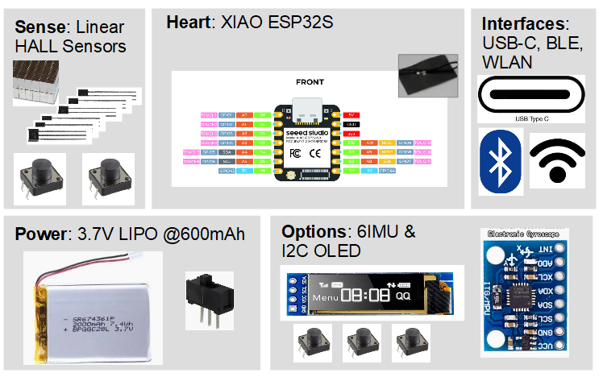

# Initial Design Concept

- The heart builds teh pretty need XIAO ESP32S with lots of processing power, BLE, WLAN interfaes as well as a modern USB-C connection. It includes an battery management part avoiding extra PCBs.
- The detection principle of the 6D motion will be done with 6 linear HALL sensors measureing the displacement of teh neodyn magnets mounted at teh knob.
- Adding an IMU in the knobn might increase the stability (using a Kalman filter to fuse the signals) and could be used to wake up the device when it is in sleep mode (which would be mandatory for battery operation).
