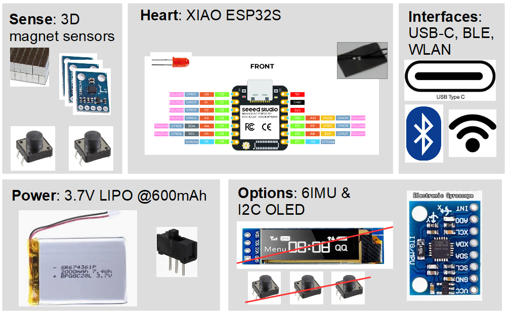

# Initial Design Concept

- The heart builds the pretty need XIAO ESP32S with lots of processing power, BLE, WLAN interfaces as well as a modern USB-C connection. It includes an battery management part avoiding extra PCBs.
- The detection principle of the 6D motion will be done with 3 3D magnetic sensors measuring the displacement of the neodyn magnets mounted at the knob.
- Adding an IMU in the knobn might increase the stability (using a Kalman filter to fuse the signals) and could be used to wake up the device when it is in sleep mode (which would be mandatory for battery operation).

 
 
\>> Back to  **[main page](index.md)**  
\>> Go to **[main repository](https://github.com/BastelBaus/Simple6DSpaceKnob)**
