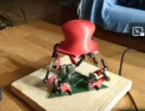
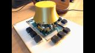
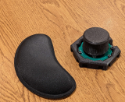
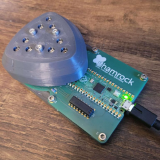
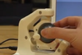
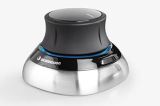

# Market Study

This page gives an overview on different DIY and professional products on the market. Last update Sep/2023.Refer also to [hackaday.io](https://hackaday.io/pages/1354157).
- [Full 6D DIY Projects](#full-6d-diy-projectsfull_6d_diy_projects)
- [Full 6D Professional Products](#full-6d-professional-products)
- [Less than 6D DIY Projects](#less-than-6d-diy-projects)

## Full 6D DIY Projects

| started | Project Name	| Author | link | Picture | Status | Detection and Electronics |	Mechanics |
| --- | ------------  |  ------ | --- | --- | --- | --- | --- |
| 2016 | Spacefox | Pepijn de Vos | [link](https://github.com/pepijndevos/spacefox)   [video](https://www.youtube.com/watch?v=rLTWWPftyac) |     | finished w/ video |Stewart platform made from potentiometers | 3D prints & cuts from triplex |
| 2022 | OS3M Mouse	| Colton Baldridge | [link](https://hackaday.io/project/187172-os3m-mouse) |  | in development | inductance to digital sensors for distance to w/ metal object as Stewart platform | 3D print (included printed spring mechanism) |
| 2022 | Shamrock Sixnav	| Brian Lu   (GreenCap)	| [link](https://www.electromaker.io/project/view/shamrock-sixnav-low-cost-compatible-6dof-space-mouse) |  | HW pictures, raw data but no final results | IR LED + Phototransistor, variable thickness plastics (IR damping) | 3D printing + Springs|
| 2022 | Space Mushroom	| Shiura | [link](https://www.instructables.com/Space-Mushroom-Full-6-DOFs-Controller-for-CAD-Appl/)   [video](https://www.youtube.com/watch?v=Vs6Xte4gOxk) |  | finished w/ video |Stewart platform made from potentiometers (3x 2D analog joysticks) | 3D printed |
|2013 | 6D (axsotic) | valentin heun | [link](http://valentinheun.com/portfolio/6d/) |  |  start of a startup which is no longer existing  | ? | 3D printed ? |

to be added
https://github.com/RepRapLtd/6DInput/tree/main/RepRapLtd#update-3
	https://reprapltd.com/an-open-source-spacemouse-for-cad-part-2/

## Full 6D Professional Products

| Product Name	| Company | Picture | Technology | Comment |
| ------------  |  ------ | --- | --- | --- |
| SpaceMouse | [3D connexion](https://3dconnexion.com/de/) |  | 3 or 6 optical position sensors with 6 LEDs and slit structure, 3 springs, plastic housing and metal block mount | Probably the market leader   Teardowns: [link](https://www.alvarez-engineer.com/2022/03/20/spacenavigator-teardown/) or [link](https://www.fictiv.com/teardowns/spacenavigator-3d-mouse-teardown) or [video](https://www.youtube.com/watch?v=1R7NCH_1UDI)

## Less than 6D DIY Projects

- 
-

 
 
\>> Back to  **[main page](index.md)**  
\>> Go to **[main repository](https://github.com/BastelBaus/Simple6DSpaceKnob)**
